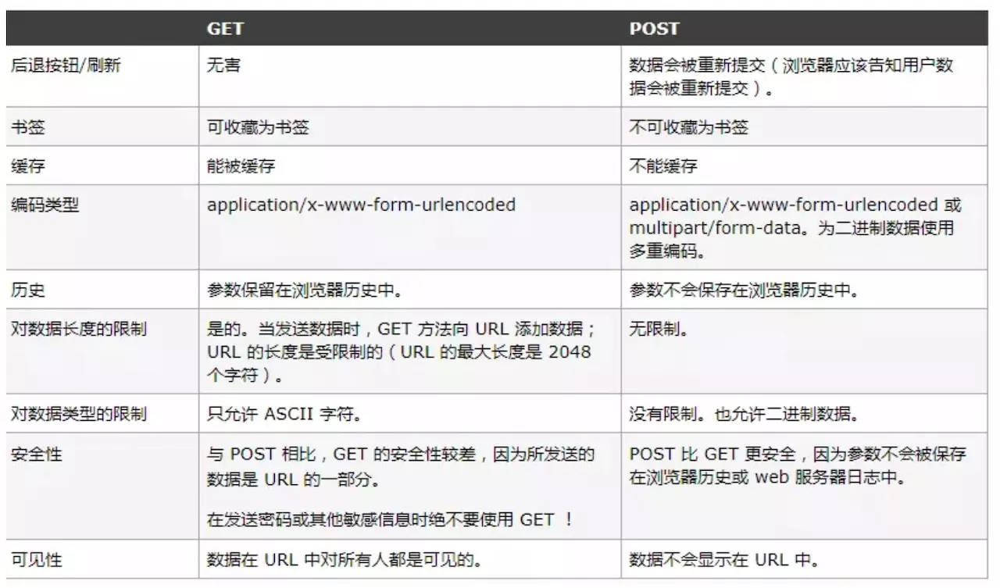

### http
---
超文本传输协议（HTTP，HyperText Transfer Protocol)是互联网上应用最为广泛的一种网络协议。
所有的WWW文件都必须遵守这个标准。设计HTTP最初的目的是为了提供一种发布和接收HTML页面的方法。


### http方法
HTTP 支持几种不同的请求命令，这些命令被称为 HTTP 方法(HTTP method)。每 条 HTTP 请求报文都包含一个方法。这个方法会告诉服务器要执行什么动作(获取 一个 Web 页面、运行一个网关程序、删除一个文件等)。
|  HTTP方法 | 描述 |
| ------ | ------ |
| GET | 从服务器向客户端发送命名资源|
| POST | 将来自客户端的数据存储到一个命名的服务器资源中去|
| DELETE | 从服务器中删除命名资源 |
| POST | 将客户端数据发送到一个服务器网关应用程序 |
| HEAD | 仅发送命名资源响应中的 HTTP 首部 |



### http/https 协议
* 1.0 协议缺陷:
  * 无法复用链接，完成即断开，重新慢启动和 TCP 3次握手
  * head of line blocking: 线头阻塞，导致请求之间互相影响
* 1.1 改进:
  * 长连接(默认 keep-alive)，复用
  * host 字段指定对应的虚拟站点
  * 新增功能:
    * 断点续传
    * 身份认证
    * 状态管理
    * cache 缓存
      * Cache-Control
      * Expires
      * Last-Modified
      * Etag
* 2.0:
  * 多路复用
  * 二进制分帧层: 应用层和传输层之间
  * 首部压缩
  * 服务端推送
* https: 较为安全的网络传输协议
  * 证书(公钥)
  * SSL 加密
  * 端口 443

* TCP:
  * 三次握手
    :::tip 三次握手
      * 客户端发送 syn(同步序列编号) 请求，进入 syn_send 状态，等待确认
      * 服务端接收并确认 syn 包后发送 syn+ack 包，进入 syn_recv 状态
      * 客户端接收 syn+ack 包后，发送 ack 包，双方进入 established 状态
    :::
  * 四次挥手
    :::tip 四次握手
      * 客户端 -- FIN --> 服务端， FIN—WAIT
      * 服务端 -- ACK --> 客户端， CLOSE-WAIT
      * 服务端 -- ACK,FIN --> 客户端， LAST-ACK
      * 客户端 -- ACK --> 服务端，CLOSED
    :::
      :::warning 为什么建立连接协议是三次握手，而关闭连接却是四次握手呢？
      这是因为服务端的LISTEN状态下的SOCKET当收到SYN报文的连接请求后，它可以把ACK和SYN(ACK起应答作用，而SYN起同步作用)放在一个报文里来发送。但关闭连接时，当收到对方的FIN报文通知时，它仅仅表示对方没有数据发送给你了；但未必你所有的数据都全部发送给对方了，所以你可能未必会马上会关闭SOCKET,也即你可能还需要发送一些数据给对方之后，再发送FIN报文给对方来表示你同意现在可以关闭连接了，所以它这里的ACK报文和FIN报文多数情况下都是分开发送的。
      :::
  * https握手过程
    * 客户端生成一个随机数（Client random），以及客户端支持的加密方法
    * 服务端确认双方使用的加密方法，并给出数字证书，以及服务器生成的随机数（Sever random）
    * 客户端确认数字证书有效，然后生成一个新的随机数（Premaster secret），并使用数字证书中的公钥加密这个随机数，发送给服务端
    * 服务端使用自己的私钥获取可客户端发来的随机数（Premaster secret）
    * 客户端和服务端根据约定的加密方法（使用前面是哪个随机数），生成“对话秘钥（session key）， 用来加密接下来的整个对话过程”
  * 滑动窗口: 流量控制
  * 拥塞处理

* 缓存策略: 可分为 强缓存 和 协商缓存
  * Cache-Control/Expires: 浏览器判断缓存是否过期，未过期时，直接使用强缓存，Cache-Control的 max-age 优先级高Expires
  * 当缓存已经过期时，使用协商缓存
    * 唯一标识方案: Etag(response 携带) & If-None-Match(request携带，上一次返回的 Etag): 服务器判断资源是否被修改
    * 最后一次修改时间: Last-Modified(response) & If-Modified-Since (request，上一次返回的Last-Modified)
      * 如果一致，则直接返回 304 通知浏览器使用缓存
      * 如不一致，则服务端返回新的资源
  * Last-Modified 缺点：
    * 周期性修改，但内容未变时，会导致缓存失效
    * 最小粒度只到 s， s 以内的改动无法检测到
  * Etag 的优先级高于 Last-Modified

### 跨域
  * JSONP: 利用`<script>`标签不受跨域限制的特点，缺点是只能支持 get 请求
    ```js
    function jsonp(url, jsonpCallback, success) {
      const script = document.createElement('script')
      script.src = url
      script.async = true
      script.type = 'text/javascript'
      window[jsonpCallback] = function(data) {
        success && success(data)
      }
      document.body.appendChild(script)
    }
    ```
  * 设置 CORS: Access-Control-Allow-Origin：*
  * postMessage

