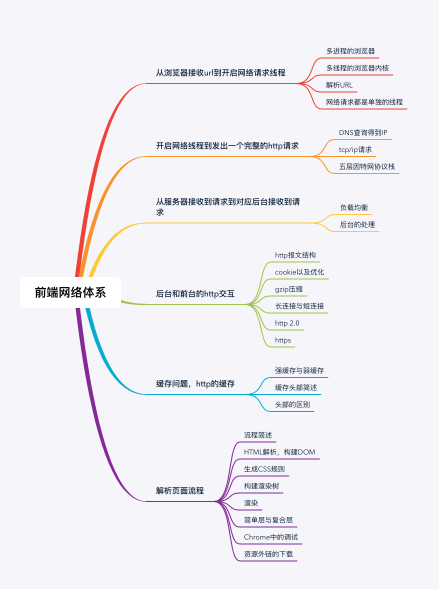

### http
---
超文本传输协议（HTTP，HyperText Transfer Protocol)是互联网上应用最为广泛的一种网络协议。
所有的WWW文件都必须遵守这个标准。设计HTTP最初的目的是为了提供一种发布和接收HTML页面的方法。


### DNS查询得到IP
如果输入的是域名，需要进行dns解析成IP，大致流程：

* 如果浏览器有缓存，直接使用浏览器缓存，否则使用本机缓存，再没有的话就是用host
* 如果本地没有，就向dns域名服务器查询（当然，中间可能还会经过路由，也有缓存等），查询到对应的IP

:::warning
注意，域名查询时有可能是经过了CDN调度器的（如果有cdn存储功能的话）
而且，需要知道dns解析是很耗时的，因此如果解析域名过多，会让首屏加载变得过慢，可以考虑dns-prefetch优化
:::

### 五层因特网协议栈
从客户端发出http请求到服务器接收，中间会经过一系列的流程

简括就是：

从应用层的发送http请求，到传输层通过三次握手建立tcp/ip连接，再到网络层的ip寻址，再到数据链路层的封装成帧，最后到物理层的利用物理介质传输。

五层因特网协议栈其实就是：

1. 应用层(dns,http) DNS解析成IP并发送http请求
2. 传输层(tcp,udp) 建立tcp连接（三次握手）
3. 网络层(IP,ARP) IP寻址
4. 数据链路层(PPP) 封装成帧
5. 物理层(利用物理介质传输比特流) 物理传输（然后传输的时候通过双绞线，电磁波等各种介质）

### 负载均衡
对于大型的项目，由于并发访问量很大，所以往往一台服务器是吃不消的，所以一般会有若干台服务器组成一个集群，然后配合反向代理实现负载均衡

简单的说：
用户发起的请求都指向调度服务器（反向代理服务器，譬如安装了nginx控制负载均衡），然后调度服务器根据实际的调度算法，分配不同的请求给对应集群中的服务器执行，然后调度器等待实际服务器的HTTP响应，并将它反馈给用户

### 后台的处理
一般后台都是部署到容器中的，所以一般为：
* 先是容器接受到请求（如tomcat容器）
* 然后对应容器中的后台程序接收到请求（如java程序）
* 然后就是后台会有自己的统一处理，处理完后响应响应结果

概括如下：
* 一般有的后端是有统一的验证的，如安全拦截，跨域验证
* 如果这一步不符合规则，就直接返回了相应的http报文（如拒绝请求等）
* 然后当验证通过后，才会进入实际的后台代码，此时是程序接收到请求，然后执行（譬如查询数据库，大量计算等等）
* 等程序执行完毕后，就会返回一个http响应包（一般这一步也会经过多层封装）
* 然后就是将这个包从后端发送到前端，完成交互

### http报文结构
报文一般包括了：通用头部，请求/响应头部，请求/响应体

**通用头部**
```js
Request Url: 请求的web服务器地址
Request Method: 请求方式
（Get、POST、OPTIONS、PUT、HEAD、DELETE、CONNECT、TRACE）
Status Code: 请求的返回状态码，如200代表成功
Remote Address: 请求的远程服务器地址（会转为IP）
```
:::tip 常见状态码
* 200——表明该请求被成功地完成，所请求的资源发送回客户端
* 304——自从上次请求后，请求的网页未修改过，请客户端使用本地缓存
* 400——客户端请求有错（譬如可以是安全模块拦截）
* 401——请求未经授权
* 403——禁止访问（譬如可以是未登录时禁止）
* 404——资源未找到
* 500——服务器内部错误
* 503——服务不可用
...
:::

#### 请求/响应头部
常用的请求头部（部分）：
```js
`Accept`: 接收类型，表示浏览器支持的MIME类型（对标服务端返回的Content-Type）
`Accept-Encoding`：浏览器支持的压缩类型,如gzip等,超出类型不能接收
`Content-Type`：客户端发送出去实体内容的类型
`Cache-Control`: 指定请求和响应遵循的缓存机制，如no-cache
`If-Modified-Since`：对应服务端的Last-Modified，用来匹配看文件是否变动，只能精确到1s之内，http1.0中
`Expires`：缓存控制，在这个时间内不会请求，直接使用缓存，http1.0，而且是服务端时间
`Max-age`：代表资源在本地缓存多少秒，有效时间内不会请求，而是使用缓存，http1.1中
`If-None-Match`：对应服务端的ETag，用来匹配文件内容是否改变（非常精确），http1.1中
`Cookie`: 有cookie并且同域访问时会自动带上
`Connection`: 当浏览器与服务器通信时对于长连接如何进行处理,如keep-alive
`Host`：请求的服务器URL
`Origin`：最初的请求是从哪里发起的（只会精确到端口）,Origin比Referer更尊重隐私
`Referer`：该页面的来源URL(适用于所有类型的请求，会精确到详细页面地址，csrf拦截常用到这个字段)
`User-Agent`：用户客户端的一些必要信息，如UA头部等

```
常用的响应头部（部分）：
```js
`Access-Control-Allow-Headers`: 服务器端允许的请求Headers
`Access-Control-Allow-Methods`: 服务器端允许的请求方法
`Access-Control-Allow-Origin`: 服务器端允许的请求Origin头部（譬如为*）
`Content-Type`：服务端返回的实体内容的类型
`Date`：数据从服务器发送的时间
`Cache-Control`：告诉浏览器或其他客户，什么环境可以安全的缓存文档
`Last-Modified`：请求资源的最后修改时间
`Expires`：应该在什么时候认为文档已经过期,从而不再缓存它
`Max-age`：客户端的本地资源应该缓存多少秒，开启了Cache-Control后有效
`ETag`：请求变量的实体标签的当前值
`Set-Cookie`：设置和页面关联的cookie，服务器通过这个头部把cookie传给客户端
`Keep-Alive`：如果客户端有keep-alive，服务端也会有响应（如timeout=38）
`Server`：服务器的一些相关信息
```

### cookie以及优化
cookie是浏览器的一种本地存储方式，一般用来帮助客户端和服务端通信的，常用来进行身份校验，结合服务端的session使用。

### http/https 协议
* 1.0 协议缺陷:
  * 无法复用链接，完成即断开，重新慢启动和 TCP 3次握手
  * head of line blocking: 线头阻塞，导致请求之间互相影响
* 1.1 改进:
  * 长连接(默认 keep-alive)，复用
  * host 字段指定对应的虚拟站点
  * 新增功能:
    * 断点续传
    * 身份认证
    * 状态管理
    * cache 缓存
      * Cache-Control
      * Expires
      * Last-Modified
      * Etag
* 2.0:
  * 多路复用
  * 二进制分帧层: 应用层和传输层之间
  * 首部压缩
  * 服务端推送
* https: 较为安全的网络传输协议
  * 证书(公钥)
  * SSL 加密
  * 端口 443

* TCP:
  * 三次握手
    :::tip 三次握手
      * 客户端发送 syn(同步序列编号) 请求，进入 syn_send 状态，等待确认
      * 服务端接收并确认 syn 包后发送 syn+ack 包，进入 syn_recv 状态
      * 客户端接收 syn+ack 包后，发送 ack 包，双方进入 established 状态
    :::
  * 四次挥手
    :::tip 四次握手
      * 客户端 -- FIN --> 服务端， FIN—WAIT
      * 服务端 -- ACK --> 客户端， CLOSE-WAIT
      * 服务端 -- ACK,FIN --> 客户端， LAST-ACK
      * 客户端 -- ACK --> 服务端，CLOSED
    :::
      :::warning 为什么建立连接协议是三次握手，而关闭连接却是四次握手呢？
      这是因为服务端的LISTEN状态下的SOCKET当收到SYN报文的连接请求后，它可以把ACK和SYN(ACK起应答作用，而SYN起同步作用)放在一个报文里来发送。但关闭连接时，当收到对方的FIN报文通知时，它仅仅表示对方没有数据发送给你了；但未必你所有的数据都全部发送给对方了，所以你可能未必会马上会关闭SOCKET,也即你可能还需要发送一些数据给对方之后，再发送FIN报文给对方来表示你同意现在可以关闭连接了，所以它这里的ACK报文和FIN报文多数情况下都是分开发送的。
      :::
  * https握手过程
    * 客户端生成一个随机数（Client random），以及客户端支持的加密方法
    * 服务端确认双方使用的加密方法，并给出数字证书，以及服务器生成的随机数（Sever random）
    * 客户端确认数字证书有效，然后生成一个新的随机数（Premaster secret），并使用数字证书中的公钥加密这个随机数，发送给服务端
    * 服务端使用自己的私钥获取可客户端发来的随机数（Premaster secret）
    * 客户端和服务端根据约定的加密方法（使用前面是哪个随机数），生成“对话秘钥（session key）， 用来加密接下来的整个对话过程”
  * 滑动窗口: 流量控制
  * 拥塞处理

* 缓存策略: 可分为 强缓存 和 协商缓存
  * Cache-Control/Expires: 浏览器判断缓存是否过期，未过期时，直接使用强缓存，Cache-Control的 max-age 优先级高Expires
  * 当缓存已经过期时，使用协商缓存
    * 唯一标识方案: Etag(response 携带) & If-None-Match(request携带，上一次返回的 Etag): 服务器判断资源是否被修改
    * 最后一次修改时间: Last-Modified(response) & If-Modified-Since (request，上一次返回的Last-Modified)
      * 如果一致，则直接返回 304 通知浏览器使用缓存
      * 如不一致，则服务端返回新的资源
  * Last-Modified 缺点：
    * 周期性修改，但内容未变时，会导致缓存失效
    * 最小粒度只到 s， s 以内的改动无法检测到
  * Etag 的优先级高于 Last-Modified

### 跨域
  * JSONP: 利用`<script>`标签不受跨域限制的特点，缺点是只能支持 get 请求
    ```js
    function jsonp(url, jsonpCallback, success) {
      const script = document.createElement('script')
      script.src = url
      script.async = true
      script.type = 'text/javascript'
      window[jsonpCallback] = function(data) {
        success && success(data)
      }
      document.body.appendChild(script)
    }
    ```
  * 设置 CORS: Access-Control-Allow-Origin：*
  * postMessage
