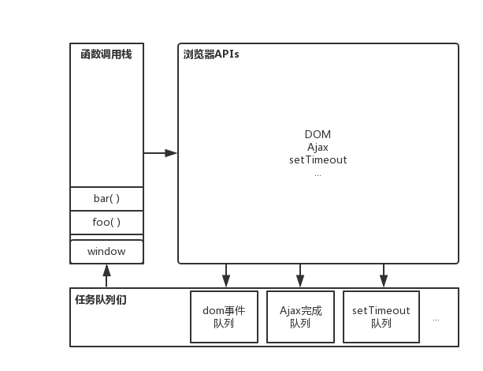
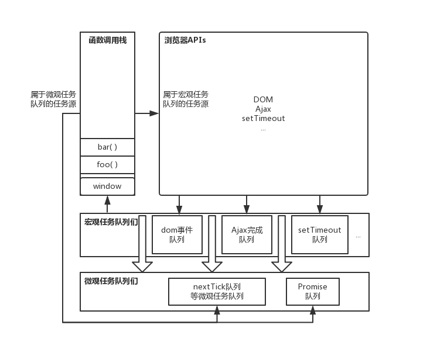

### 事件循环
JS是单线程的，但是像Ajax，或是DOM事件这种很耗时的操作，需要用并发处理，否则单线程会长时间等待，什么也做不了。而单线程循环就是并发的一种形式，一个线程中只有一个事件循环。而任务队列是用来配合事件循环完成操作的，一个线程可以拥有多个任务队列。
:::tip 
事件循环与任务队列是JS中比较重要的两个概念。这两个概念在ES5和ES6两个标准中有不同的实现。尤其在ES6标准中，清楚的区分宏观任务队列和微观任务队列才能解释Promise一些看似奇怪的表现。
:::

### 任务队列
故名思意，排着任务的队列。所谓任务是WebAPIs返回的一个个通知，让JS主线程在读取任务队列的时候得知这个异步任务已经完成，下一步该执行这个任务的回调函数了。主线程拥有多个任务队列，不同的任务队列用来排列来自不同任务源的任务。任务源是什么？像setTimeout/Promise/DOM事件等都是任务源，来自同类任务源的任务我们称它们是同源的，比如setTimeout与setInterval就是同源的。在ES6标准中任务队列又分为宏观任务队列和微观任务队列

### ES5中事件循环


图中有三大块：
1. 函数调用栈：即执行栈；
2. WebAPIs：浏览器的接口。比如一个Ajax操作，主线程会把收发Ajax交给浏览器的API，之后就继续做别的事情，浏览器在接收到Ajax返回的数据之后，会把一个Ajax完成的事件排到相应的任务队列后边。
3. 任务队列们：主线程中有多个任务队列，同源的任务排在属于自己的任务队列。

一个具体点的栗子。比如现在打开了一个页面，里边有一段`<script>`，其中有Ajax，DOM操作等等。这段JS是在浏览器提供的全局环境（浏览器中是window）里执行的，执行中遇到函数调用时会压入执行栈。

1. 主线程在遇到Ajax或是setTimeout这种异步操作时会交给浏览器的WebAPIs，然后继续执行后边的代码，直到最后执行栈为空。
2. 浏览器会在不确定的时间将完成的任务返回，排到相应的任务队列后。
3. 执行栈为空后，主线程会到任务队列中去取任务，这些任务会告诉下一步应该执行哪些回调函数。任务队列是具有优先级的，按照优先级决定访问的先后顺序。而优先级在不同的环境中会有所不同，所以不能给出一个固定的优先级。
4. 每访问一个队列，执行栈会执行完这个任务队列的所有的代码，然后再取下一个任务队列需要执行的的代码。如果在执行中遇到了当前属于任务队列的异步任务时。此次任务的返回不会直接排到当前任务队列之后。因为这属于两次不同的事件循环，会被区分开来。

**就这样循环执行，直到三大块全为空，这称为事件循环**

### ES6中的事件循环-宏观任务队列（macrotask queue）、微观任务队列（microtask queue）
ES6标准中任务队列存在两种类型，一种就是上边提到的一些队列，比如setTimeout、网络请求Ajax、用户I\O等都属于宏观任务队列（macrotask queue），另一种是微观任务队列（microtask queue），Promise就属于微观任务队列。


在执行栈执行的过程中会把属于微观任务队列的任务分配到相应的微观任务队列中去。而在调用栈执行空之后，主线程读取任务队列时，会先读取所有微观任务队列，然后读取一个宏观任务队列，再读取所有的微观任务队列

:::tip 常见的一些宏任务和微任务
macrotask:
* setTimeout
* setInterval
* setImmediate
* requestAnimationFrame
* I/O
* UI rendering

microtask:
* process.nextTick
* Promises
* Object.observe
* MutationObserver
:::

#### example

```js
setTimeout(() => {
  console.log(1)
}, 0)

new Promise((resolve) => {
  console.log(2)
  for (let i = 0; i < 100; i++) {
    i == 99 && resolve()
  }
  console.log(3)
})
.then(() => {
  console.log(4)
})

console.log(5)
```
* 脚本开始执行，最先遇到setTimeout，交给浏览器去计时，达到setTimeout限制最短计时之后，把这个任务推入setTimeout队列(macrotask)。
* 遇到Promise构造函数，构造函数参数执行，输出2，调用resolve改变Promise对象的状态，然后输出3
* Promise对象调用then方法，将这个任务推入Promise任务队列(microtask)
* 执行console.log(5)，输出5
* 调用栈为空，读取任务队列，按照: 读取所有微观任务队列 -> 读取一个宏观任务队列 -> 读取所有微观任务队列 ...
* 读取所有微观任务队列中的任务，执行这些任务指定的回调函数。执行then指定的回调函数，输出4（微观任务队列也具有优先级）
* 最后读取到setTimeout的任务，执行回调函数，输出4

> 所以输出的结果为： 2 3 5 4 1