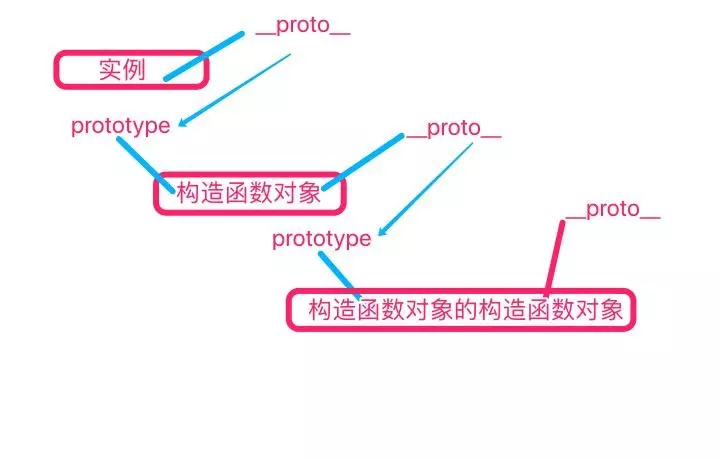

### 构造函数
JavaScript的构造函数并不是作为类的一个特定方法存在的；当任意一个普通函数用于创建一类对象时，它就被称作构造函数，或构造器。一个函数要作为一个真正意义上的构造函数，需要满足下列条件：
1. 在函数内部对新对象（this）的属性进行设置，通常是添加属性和方法。
2. 构造函数可以包含返回语句（不推荐），但返回值必须是this，或者其它非对象类型的值。

再看自定义函数与Function之间到底存在着什么关系？它两有什么区别？

ECMAScript规定了两个特殊的内置对象：Object和Function。他们的特殊性在于，他们本身既是对象又是函数，而他们同时也是对象和函数的构造器。
1. Object
Object对象本身是一个函数对象。既然是Object函数，就肯定会有prototype属性，所以可以看到”Object.prototype”的值就是”Object {}”这个原型对象。反过来，当访问”Object.prototype”对象的”constructor”这个属性的时候，就得到了Obejct函数。
Function
2. JavaScript中函数也是对象，所以就可以通过proto查找到构造函数对象的原型。
Function对象作为一个函数，就会有prototype属性，该属性将对应”function () {}”对象。
Function对象作为一个对象，就有proto属性，该属性对应”Function.prototype”，也就是说，”Function.proto === Function.prototype”。


### _proto_和prototype

#### _proto_
_proto_属性存在每个对象中，用来指向创建它的对象的prototype。打个比方假如你是一个对象谁生了你你得_proto_就指向谁的prototype。

#### prototype
prototype属性存在每个函数对象中，当一个函数被用作构造函数来创建实例的时候，该函数的prototype属性将被作为原型赋值给所有创建的实例（也就时候实例中的_proto_）

```js
const Demo = function () {
  this.name = 'demo'
  this.sayName = function () {
    console.log(this.name)
  }
}

const instanceA = new Demo()
const instanceB = new Demo()

console.log(instanceA.__proto__ === Demo.prototype)
console.log(instanceB.__proto__ === Demo.prototype)
// true
// true
```

### 原型链

每个对象都有原型，一个实例的_proto_指向创建它的构造函数对象的prototpe，而构造函数对象的_proto_又指向父级构造函数原对象的prototype，这样层层的连接就形成了原型链。如下图所示蓝色所形成的就称为原型链。

每个对象都有constructor指向父级对象所以全部关系图如下。


### 原型继承
看下面例子
```js
const Demo = function () {
  this.name = 'demo'
  this.sayName = function () {
    console.log(this.name)
  }
}

const instanceA = new Demo()
console.log(instanceA,name) // demo
instanceB.sayName() // demo
```
instanceA通过原型链访问到了Demo的属性与方法。换一种说法就是instanceA继承了Demo的属性与方法。
```js
const instanceA = new Demo()
instanceA.name = 'instanceA'
instanceA.sayName() // instanceA
```
在我们为instanceA添加一个name属性的时候输出的却是后面添加的属性值。这就牵扯到了属性优先级（这里这样称呼）
:::tip 优先级
优先级原则：函数对象本身的属性或方法的优先级要高于原型的属性或方法
:::
:::tip 总结
总结：
1.原型和原型链是Js实现继承的一种模型。
2.原型链的形成真正靠的是proto而非prototype.
:::